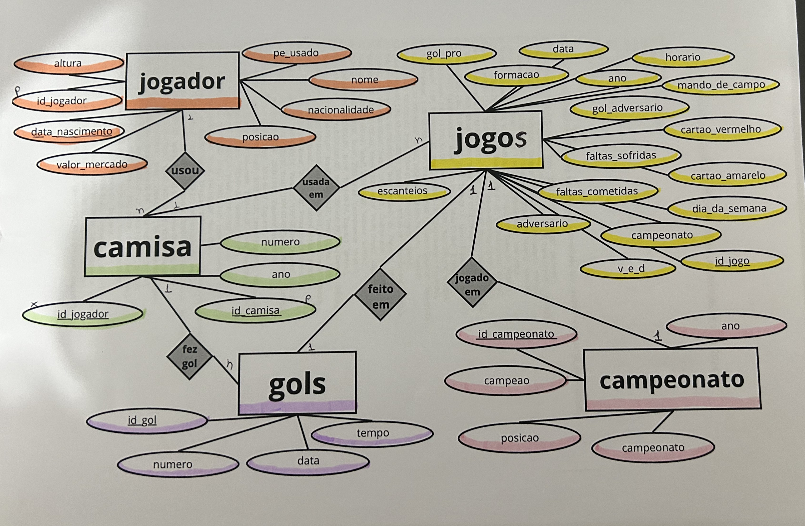

# palmeiras-dados-futebol
Banco de dados relacional estruturado em SQLite para análise de desempenho e estatísticas do Palmeiras entre 2021 e 2024.
# ⚽ Análise de Dados e Estatísticas: Palmeiras (2021-2024)

## 📌 Sobre o Projeto
Este projeto foi desenvolvido com o objetivo de estruturar e analisar dados de desempenho do Palmeiras entre os anos de 2021 e 2024. A iniciativa nasceu da necessidade de aplicar conceitos práticos de modelagem de dados e consultas SQL em um cenário dinâmico.

Todo o levantamento, estruturação e normalização dos dados foram feitos do zero, transformando informações brutas em um banco de dados relacional completo em **SQLite**.

## 🗄️ Modelagem do Banco de Dados
O banco foi estruturado garantindo a normalização dos dados e o uso correto de chaves primárias e estrangeiras. Ele é composto por 5 tabelas interligadas:
* **jogador:** Dados cadastrais (nome, posição, nacionalidade, valor de mercado, etc.).
* **camisa:** Histórico de qual jogador usou qual número em cada ano.
* **jogos:** Registro das partidas (data, adversário, formação tática, mando de campo, cartões, etc.).
* **gols:** Registro detalhado dos gols marcados (tempo, número da camisa do marcador).
* **campeonato:** Competições disputadas.

### Diagrama Entidade-Relacionamento (DER)
Abaixo está o esquema desenhado durante o planejamento lógico do banco de dados:

## 📊 Consultas e Insights
O arquivo `analises_palmeiras.sql` contém extrações complexas desenvolvidas para responder a perguntas estatísticas e táticas, exigindo o uso avançado de junções relacionais (`JOINs`), agrupamentos (`GROUP BY`) e funções de agregação (`SUM`, `COUNT`, `AVG`). 

Algumas das análises codificadas incluem:
1. **O Artilheiro do Período:** Cruzamento de 4 tabelas para identificar quem marcou mais gols, resolvendo de forma lógica a variação dos números de camisa por ano.
2. **Tática e Eficiência:** Avaliação de qual esquema tático (formação) resultou no maior volume absoluto de vitórias.
3. **O Fator Casa vs. Cartões:** Impacto do mando de campo na média de faltas cometidas e cartões amarelos recebidos.

## 🛠️ Tecnologias e Habilidades Aplicadas
* **Linguagem:** SQL
* **SGBD:** SQLite
* **Competências:** Modelagem de Banco de Dados Relacional, Criação de DER, Análise de Dados, Consultas Complexas (Múltiplos JOINs) e Funções de Agregação.
